# Symbology Icon Library

The icon library generated using[Symbology](https://symbology.onrender.com), an AI-native visual design app for creating diagrams, presentations, and other graphic compositions.

This repository is an asset library: it contains ready-to-use SVG icons. Browse the collections, open an icon, and download or copy it into your project.

## Pixel art gallery

Explore all 100 colorful, transparent, 24 px SVG sprites in the **[interactive icon gallery](https://hantaozhangrichard.github.io/symbology-assets/)**. Search by name, filter by category, or select an icon to open its source file.

<a href="generated-icons/pixel_art/cherry-blossom.svg">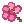</a>
<a href="generated-icons/pixel_art/lavender-sprig.svg">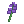</a>
<a href="generated-icons/pixel_art/flower-bouquet.svg">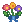</a>
<a href="generated-icons/pixel_art/potted-cactus.svg">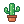</a>

<a href="generated-icons/pixel_art/four-leaf-clover.svg">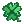</a>

<a href="generated-icons/pixel_art/mushroom.svg">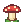</a>

<a href="generated-icons/pixel_art/angry-face.svg">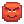</a>

<a href="generated-icons/pixel_art/thinking-face.svg">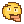</a>
<a href="generated-icons/pixel_art/party-face.svg">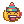</a>

<a href="generated-icons/pixel_art/cat.svg">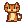</a>
<a href="generated-icons/pixel_art/dog.svg">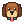</a>
<a href="generated-icons/pixel_art/rabbit.svg">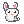</a>
<a href="generated-icons/pixel_art/fox.svg">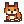</a>
<a href="generated-icons/pixel_art/bear.svg">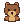</a>
<a href="generated-icons/pixel_art/panda.svg">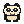</a>
<a href="generated-icons/pixel_art/koala.svg">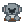</a>
<a href="generated-icons/pixel_art/frog.svg">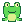</a>
<a href="generated-icons/pixel_art/pig.svg">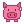</a>
<a href="generated-icons/pixel_art/cow.svg">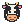</a>
<a href="generated-icons/pixel_art/chick.svg">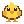</a>

<a href="generated-icons/pixel_art/owl.svg">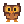</a>
<a href="generated-icons/pixel_art/duck.svg">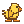</a>
<a href="generated-icons/pixel_art/bee.svg">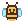</a>

<a href="generated-icons/pixel_art/butterfly.svg">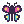</a>

<a href="generated-icons/pixel_art/turtle.svg">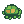</a>
<a href="generated-icons/pixel_art/goldfish.svg">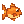</a>
<a href="generated-icons/pixel_art/whale.svg">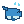</a>

<a href="generated-icons/pixel_art/crab.svg">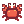</a>
<a href="generated-icons/pixel_art/dinosaur.svg">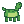</a>
<a href="generated-icons/pixel_art/unicorn.svg">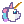</a>
<a href="generated-icons/pixel_art/apple.svg">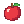</a>
<a href="generated-icons/pixel_art/strawberry.svg">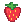</a>
<a href="generated-icons/pixel_art/watermelon-slice.svg">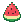</a>
<a href="generated-icons/pixel_art/cherries.svg">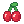</a>
<a href="generated-icons/pixel_art/avocado.svg">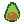</a>
<a href="generated-icons/pixel_art/carrot.svg">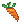</a>
<a href="generated-icons/pixel_art/toast.svg">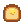</a>

<a href="generated-icons/pixel_art/burger.svg">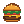</a>

<a href="generated-icons/pixel_art/donut.svg">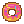</a>
<a href="generated-icons/pixel_art/cupcake.svg">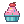</a>
<a href="generated-icons/pixel_art/ice-cream-cone.svg">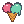</a>
<a href="generated-icons/pixel_art/coffee-cup.svg">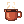</a>
<a href="generated-icons/pixel_art/bubble-tea.svg">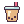</a>
<a href="generated-icons/pixel_art/birthday-cake.svg">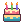</a>
<a href="generated-icons/pixel_art/alarm-clock.svg">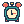</a>
<a href="generated-icons/pixel_art/camera.svg">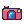</a>

<a href="generated-icons/pixel_art/game-controller.svg">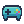</a>

<a href="generated-icons/pixel_art/backpack.svg">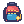</a>
<a href="generated-icons/pixel_art/umbrella.svg">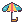</a>

<a href="generated-icons/pixel_art/cozy-mug.svg">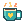</a>

## Using the icons

The pixel-art collection is stored in [`generated-icons/pixel_art`](generated-icons/pixel_art). Each icon is a self-contained SVG with a transparent background, so it can be downloaded, embedded, recolored, or edited in a vector design tool.

For the complete design experience, visit [Symbology](https://symbology.onrender.com).
